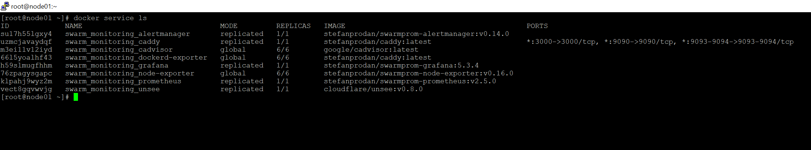

# Домашнее задание к занятию "5.5. Оркестрация кластером Docker контейнеров на примере Docker Swarm"

## Задача 1

Дайте письменые ответы на следующие вопросы:

- В чём отличие режимов работы сервисов в Docker Swarm кластере: replication и global?
- Какой алгоритм выбора лидера используется в Docker Swarm кластере?
- Что такое Overlay Network?

## Задача 2

Создать ваш первый Docker Swarm кластер в Яндекс.Облаке

Для получения зачета, вам необходимо предоставить скриншот из терминала (консоли), с выводом команды:
```
docker node ls

[root@node01 ~]# docker node ls
ID                            HOSTNAME             STATUS    AVAILABILITY   MANAGER STATUS   ENGINE VERSION
e8dxlafpmq5llv5vpkg5k66dp *   node01.netology.yc   Ready     Active         Leader           20.10.16
yrl4ekb85zklwzjo90kbo1k96     node02.netology.yc   Ready     Active         Reachable        20.10.16
wvgoiifezrttvqr8qilvzq9m0     node03.netology.yc   Ready     Active         Reachable        20.10.16
g729a4eb2x9fq6m44twwe8bcm     node04.netology.yc   Ready     Active                          20.10.16
mm8b709id2unz5xmohxd3f105     node05.netology.yc   Ready     Active                          20.10.16
c7ggvl81doa2zwc3e35a2uj44     node06.netology.yc   Ready     Active                          20.10.16
```


## Задача 3

Создать ваш первый, готовый к боевой эксплуатации кластер мониторинга, состоящий из стека микросервисов.

Для получения зачета, вам необходимо предоставить скриншот из терминала (консоли), с выводом команды:
```
docker service ls

[root@node01 ~]# docker service ls
ID             NAME                                MODE         REPLICAS   IMAGE                                          PORTS
su17h55lgxy4   swarm_monitoring_alertmanager       replicated   1/1        stefanprodan/swarmprom-alertmanager:v0.14.0
uzmcjavaydqf   swarm_monitoring_caddy              replicated   1/1        stefanprodan/caddy:latest                      *:3000->3000/tcp, *:9090->9090/tcp, *:9093-9094->9093-9094/tcp
m3ei11v12iyd   swarm_monitoring_cadvisor           global       6/6        google/cadvisor:latest
66l5yoalhf43   swarm_monitoring_dockerd-exporter   global       6/6        stefanprodan/caddy:latest
h59slmugfhhm   swarm_monitoring_grafana            replicated   1/1        stefanprodan/swarmprom-grafana:5.3.4
76zpagysgapc   swarm_monitoring_node-exporter      global       6/6        stefanprodan/swarmprom-node-exporter:v0.16.0
klpahj9wyz2m   swarm_monitoring_prometheus         replicated   1/1        stefanprodan/swarmprom-prometheus:v2.5.0
vect8gqvwvjg   swarm_monitoring_unsee              replicated   1/1        cloudflare/unsee:v0.8.0
```



## Задача 4 (*)

Выполнить на лидере Docker Swarm кластера команду (указанную ниже) и дать письменное описание её функционала, что она делает и зачем она нужна:
```
# см.документацию: https://docs.docker.com/engine/swarm/swarm_manager_locking/
docker swarm update --autolock=true
```


---

### Как cдавать задание

Выполненное домашнее задание пришлите ссылкой на .md-файл в вашем репозитории.

---